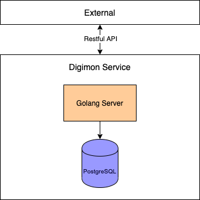

本文章同時發佈於：

- [Github(包含程式碼)]()
- [Medium]()
- [iT 邦幫忙]()

```
文章為自己的經驗與夥伴整理的內容，設計沒有標準答案，如有可以改進的地方，請告訴我，我會盡我所能的修改，謝謝大家～
```

---

大家好，接下來要介紹如何用 Golang + Docker 設計一個`數碼蛋`微服務，主要的功能是產生各個數碼世界的數碼蛋！

## 所需的架構



此 Service 的設計並不複雜，單純以一個 Restful API Golang Server 配合一個 PostgreSQL 資料庫來實作。

而這個 PostgreSQL 你以為要用安裝的嗎？不！我們以 Docker 來啟動他，這減低了安裝的許多時間成本。

這篇文章會先介紹 Docker，畢竟要先有個正常的環境，才能好好開發～

## 什麼是 Docker

簡單來說，

> Docker 是一個容器化環境，你可以在此環境運作你的程式與資源

聽起來是不是很像我們常見到的 VM？

是的其實他與 VM 相當相像，但 VM 是將`整個核心都隔離`，而 Docker 是`只隔離資源並使用原系統的核心`。

用以下的圖來解講會比較清楚:


可以看到 VM 方除了原本的系統`Host Operating System`以外，每個容器都使再多新增一個`Guest OS`系統，而容器的系統與原系統溝通都要透過`Hypervisor`來做橋樑，這也導致了在 VM 裡面跑程式都會卡到炸。

而 Docker 是直接使用原系統，只不過`App`與`Bins/Libs`等程式與資源隔離了起來，這樣就可以達到`幾乎不消耗效能`又可以`隔離環境`的效果。

## 隔離環境的好處

不知道大家有沒有中毒過，我就有一次電腦中了毒，導致想要安裝遊戲卻怎麼都裝不起來。最後我重灌了整台電腦，才把遊戲安裝完成。

在中毒時因為`環境已經有所變動`，導致安裝`程式無法執行`，而重灌後因為`環境已初始化`，所以安裝`程式順利執行`。

如果能確保每次執行的`環境都是一致的`，那程式執行的效果就會更加完善。

在以往我們只能透過 VM 來達到一致化的效果，但現在有了 Docker 我們可以更加不耗效能的隔離環境。

## 安裝 Docker

安裝的部分在`Docker`的官網都寫得很清楚了，本篇主要討論實作，我這邊就把三種系統的安裝介紹都貼上來，不說明此部分了～

- [Ubuntu](https://docs.docker.com/engine/install/ubuntu/)
- [Windows](https://docs.docker.com/docker-for-windows/install/)
- [Mac](https://docs.docker.com/docker-for-mac/install/)

## 透過 Docker 啟動 PostgreSQL

現在 Docker 已經是一門顯學，直接用 Google 搜尋`PostgreSQL DockerHub`就可以找到[官方](https://hub.docker.com/_/postgres)已將程式與資源包裝起來的 docker image。


之後我們創建一個`Dockerfile`，並將`FROM`選擇官方 PostgreSQL 的 Docker Image 即可，另外雖然此次不會用到，但我也在`Dockerfile`範例裡介紹了其他常用指令:

```Dockerfile
# 選定要運作 Docker 的 base image
FROM postgres:12.4-alpine

# 讓 Docker Image 在產生時可以複製檔案進入，以供 Docker 使用
# COPY ./data /app/data

# 即 Bash，通常透過此指令在 Docker Image 內部安裝相依的程式與資源
# RUN ls -al

# Docker 運作的資料夾位置，通常透過此指令指定 Server 的運作資料夾
# WORKDIR app

# Docker 啟動時要執行的程式
# ENTRYPOINT ["go", "run", "main.go"]
```

在`Dockerfile`的同一目錄下運作以下指令來建立你自訂的 Docker Image:

```bash
$ docker build . -t=customimage
```

- -t: 此 Docker Image 的名字

建立完畢後，就可以運行資料庫了:

```bash
$ docker run \
    -e POSTGRES_USER=user \
    -e POSTGRES_PASSWORD=mysecretpassword \
    -e PGDATA=/var/lib/postgresql/data/pgdata \
    -p 5432:5432 \
    customimage
```

- -e: Docker 內部的環境變數，通常我們會用這個環境變數來說明運行時的設定，在此是設定`POSTGRES_USER - 使用者名稱`、`POSTGRES_PASSWORD - 使用者密碼`、`PGDATA - 資料庫在 Docker 裡的位置`
- -p: 將 Docker 內部的 port mapping 到外部的 port，已讓外部系統可以連線至 Docker 內部

運行下去後就可使跑啦～如果要離開直接按`ctrl+c`即可，


最後我們輸入剛剛`-e`設定的帳密，透過資料庫管理程式連入，我這邊是使用[Postico](https://eggerapps.at/postico/)


成功！

---

接下來下篇要介紹如何透過 Docker-Compose 管理多個 Docker 環境。

謝謝你的閱讀，也歡迎分享討論指正～

## 參考

- [How does a Docker engine replace a hypervisor and guest OS?](https://stackoverflow.com/questions/43929345/how-does-a-docker-engine-replace-a-hypervisor-and-guest-os)
