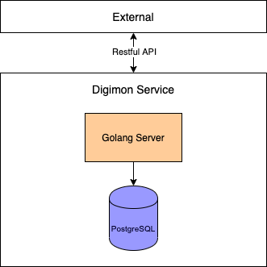

本文章同時發佈於：

- [Github(包含程式碼)]()
- [Medium]()
- [iT 邦幫忙]()

```
文章為自己的經驗與夥伴整理的內容，設計沒有標準答案，如有可以改進的地方，請告訴我，我會盡我所能的修改，謝謝大家～
```

---

[//]: # "york TODO: 新增 DAY04 連結"

大家好，繼昨天[DAY04]() Docker-Compose 的介紹後，我們終於有了一個開發環境，接下來要實作夠過各種 Docs tool 來建構各種文件與程式介面。

## 為什麼需要這些 Docs tool

> 文件與實作同步，為不同團隊提供一個簡潔的系統介紹，而不是遇到任何問題就`看code`

以前接受了許多專案，文檔提供不完全，導致許多 API 根本不清楚作用，而是要透過`看code`來了解整體情境，這花費了巨量的時間。

也不是說看 code 不好，在[Clean Code](https://www.tenlong.com.tw/products/9789862017050)書中也有提到 :

> Code 必須要清楚表達意圖，而不是靠各種註解解決

而文件跟註解有幾分相似，是否如果 code 寫得好就不需要文件了呢？

我認為還是要的，以下是我覺得需要寫成文件的部分:

- 一連串不同 API 達成的情境: 因為單純看 code 是無法說明一整個情境的。
- API 所規範的介面: 各團隊可以根據此規範來串接 API，以避免後端說要帶 a 資料前端卻帶 b 資料的窘境。

## 為什麼文件往往趕不上實作？

> 因為寫文件的成本往往高於寫 code

我認為有以下關係:

1. 當更新了 code 的功能，我們就要點開各式各樣的文件去更新
2. 文件軟體用起來有夠不順手，奇怪我是程式設計的為什麼要一天到晚畫圖
3. 為什麼文件寫的跟 code 不一樣，算了這個文件不看白不看，還是看 code

所以我已以下原則來寫文件，我認為可以減低以上問題的成本 XD:

1. 統一都用 Markdown 來寫，流程圖與關係圖用[mermaid-js](https://github.com/mermaid-js/mermaid)與[vscode-drawio](https://github.com/hediet/vscode-drawio)一次解決
2. 因為採用 Markdown 所以不用再`為了邏輯而畫圖`，而是寫好邏輯就自動產生圖
3. 用[swagger-generator](https://github.com/swagger-api/swagger-codegen)來產生程式介面，再來開發，這樣就可以`用文件產生程式介面`。

## 這些 Docs tool 是？

- [mermaid-js](https://github.com/mermaid-js/mermaid): 提供用簡單的 Markdown 來撰寫流程圖的功能
- [vscode-drawio](https://github.com/hediet/vscode-drawio): 可以讓 vscode 可以直接在`.jpg/.png`中編輯圖片並同步更新在 Markdown 中
- [swagger-generator](https://github.com/swagger-api/swagger-codegen): [swagger](https://github.com/swagger-api)是一個撰寫 API 介面的方案，大家常常拿它來撰寫介面，但其實他也可以透過這些文件來生產出`不同語言的Server端與Client端`，對於規範好不同團隊語言的接口很方便。

## 開始來基於 Digimon-Service 來撰寫文件～

![From Youtube: 2019 Bandai 20th Anniversary Digimon Virtual Pet Unboxing & Review [4K UHD]](https://i.imgur.com/mtnMhIk.jpg)

還記得小時候玩的數碼育成機嗎？一開始會有一顆數碼蛋，我們要慢慢培育他，隨著時間這顆數碼蛋就會孵化出數碼獸，並與我們一起成長。Digimon-Service 希望可以提供這些功能。

所以基於這些需求，我們開始把文件撰寫出來～

---

Digimon-Service 結構圖 - 使用[vscode-drawio](https://github.com/hediet/vscode-drawio)完成:



提供的功能：

- 提供一個數碼蛋，讓 client 端可以領取。
- 數碼蛋會隨著時間孵化。
- 我們要定期培育數碼獸，不然他會死亡。

---

實作我們採用 Restful API，以下是 API - 使用[swagger](https://github.com/swagger-api)完成:

```yaml
# swagger.yaml
openapi: 3.0.1
info:
  title: Digimon Service API
  description: 提供孵化數碼蛋與培育等數碼寶貝養成服務
  version: 1.0.0
servers:
  - url: https://localhost/api/v1
paths:
  /digimons:
    post:
      summary: 產生數碼蛋
      description: 產生一顆數碼蛋，供request端養成
      requestBody:
        description: 客製數碼蛋的請求
        required: true
        content:
          application/json:
            schema:
              type: object
              properties:
                name:
                  type: string
                  description: 數碼蛋的名字
              required:
                - name
            example:
              name: Agumon
      responses:
        200:
          description: 數碼蛋的資訊
          content:
            application/json:
              schema:
                $ref: "#/components/schemas/DigimonInfo"
  /digimons/{digimonID}:
    get:
      description: 查看數碼蛋狀態
      parameters:
        - in: path
          name: digimonID
          schema:
            type: string
          required: true
          description: 數碼蛋的唯一識別碼，格式為uuid v4
      responses:
        200:
          description: 數碼蛋的資訊
          content:
            application/json:
              schema:
                $ref: "#/components/schemas/DigimonInfo"
  /digimons/{digimonID}:foster:
    post:
      summary: 培育數碼獸
      description: 對數碼獸進行培育，以改善數碼獸的狀態
      parameters:
        - in: path
          name: digimonID
          schema:
            type: string
          required: true
          description: 數碼蛋的唯一識別碼，格式為uuid v4
      requestBody:
        description: 培育的食物
        required: true
        content:
          application/json:
            schema:
              type: object
              properties:
                foot:
                  type: object
                  description: 培育所使用的食物
                  properties:
                    name:
                      type: string
                      description: 食物名稱
                      example: apple
      responses:
        200:
          description: 培育完畢後的數碼獸的資訊
          content:
            application/json:
              schema:
                $ref: "#/components/schemas/DigimonInfo"
components:
  schemas:
    DigimonInfo:
      type: object
      properties:
        id:
          type: string
          description: 數碼蛋的唯一識別碼，格式為uuid v4
          example: 56e400bd-c98b-49b9-ad8c-0607800e026f
        name:
          type: string
          description: 數碼蛋的名稱
          example: Agumon
        status:
          type: string
          description: 數碼蛋此時的狀態
          example: healthy
```

[\\]: # "york todo新增連結"

看起來可能不是很好懂，沒關係 swagger 也提供了[swagger-ui](https://github.com/swagger-api/swagger-ui)讓文件更好讀，只需在[DAY05]()資料夾下運作:

```bash
$ docker run -it -p 8080:8080 -e SWAGGER_JSON=/local/swagger.yaml -v ${PWD}:/local swaggerapi/swagger-ui
```

在開啟`localhost:8080`後，就會有精美的網頁了！


---

資料庫如下 - 使用[vscode-drawio](https://github.com/hediet/vscode-drawio)完成:


- Digimons: 紀錄數碼獸狀態
- Diets: 紀錄數碼獸飲食

---

流程上如下 - 使用[mermaid-js](https://github.com/mermaid-js/mermaid)完成:

產生數碼蛋

```mermaid
sequenceDiagram
    participant c as Client
    participant s as Digimon-Service
    participant db as PostgreSQL
    c->>s: 使用 API POST api/v1/digimons
    s->>s: 產生數碼蛋，即是Digimons table需要的資料
    s->>db: 將數碼蛋存進Digimons table
    s-->>c: 回傳成功
```

培育數碼獸

```mermaid
sequenceDiagram
    participant c as Client
    participant s as Digimon-Service
    participant db as PostgreSQL
    c->>s: 使用 API POST api/v1/digimons/:digimonID/foster
    alt 已經過久沒有餵食
        s-->>c: 更新Digimon table的status至死亡
    else
        s->>db: 將request的diet資料存入Diets table
        s->>db: 更新Digimon table的status至健康
    end
    s-->>c: 回傳成功
```

查看數碼獸

```mermaid
sequenceDiagram
    participant c as Client
    participant s as Digimon-Service
    participant db as PostgreSQL
    c->>s: 使用 API GET api/v1/digimons/:digimonID
    s->>db: 撈取Digimon table的數碼獸資料
    alt 已經過久沒有餵食
        s-->>c: 回傳死亡
    else status是'死亡'
        s-->>c: 回傳死亡
    else
        s-->>c: 回傳數碼獸資料
    end
```

## 總結

有了這些便捷的工具後，生產文件就不是個很`花費時間又重工`的事情了，接下來要介紹如何透過[swagger-generator](https://github.com/swagger-api/swagger-codegen): [swagger](https://github.com/swagger-api)生產出 Golang Server 的介面並且透過 Clean Architecture 來實作，讓我們的文件可以實際發揮程式在程式碼中，而不是永遠都在開發玩程式碼才想到的角色！

---

謝謝你的閱讀，也歡迎分享討論指正～

## 參考

- [2019 Bandai 20th Anniversary Digimon Virtual Pet Unboxing & Review [4K UHD]](https://www.youtube.com/watch?v=FuzMB5y8rOw)
- [奔跑吧！台北：程式幕後分享](https://medium.com/@chiunhau/%E5%A5%94%E8%B7%91%E5%90%A7-%E5%8F%B0%E5%8C%97-%E7%A8%8B%E5%BC%8F%E5%B9%95%E5%BE%8C%E5%88%86%E4%BA%AB-e02d0a565559)
